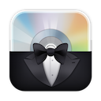
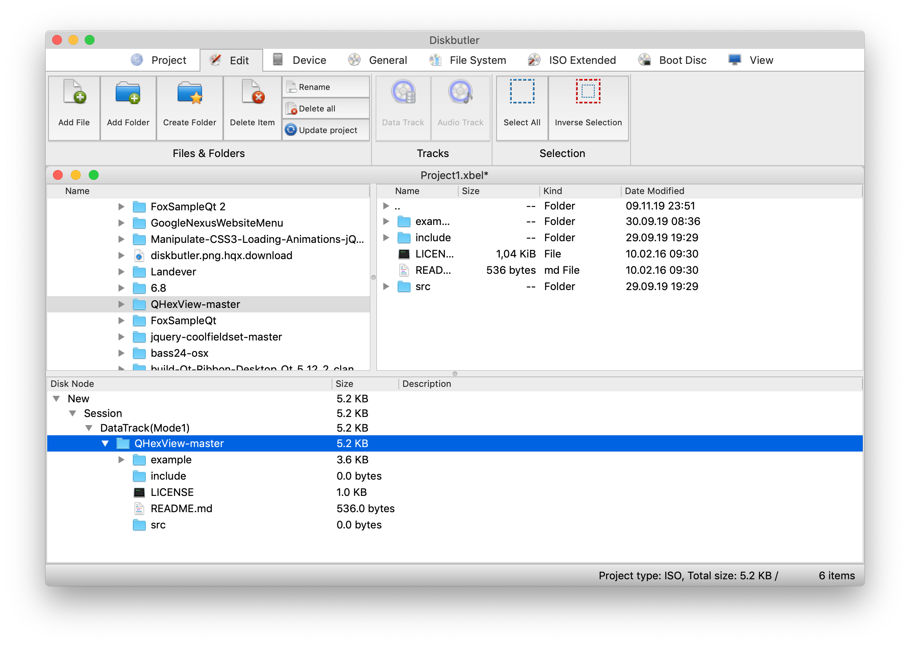

# Diskbutler

## The free x-platform CD/DVD/BD recording software

Diskbutler was born some time ago to bring a professional CD/DVD/BD recording software, that will work on macOS, Linux and Windows. 
With the full feature set, to the end user. 
Diskbutler is written in QT and use the well known FoxBurner SDK.



DiskButler uses Qt 6 or Qt5 and IsoSDK 10.7.1. 

# Compiling

To compile from source:

```
docker build -t diskbutler .
docker run -it --rm -v $(pwd):/workdir -w="/workdir" diskbutler just build
```

To remove all of the intermediary files and build output:

```
docker run -it --rm -v $(pwd):/workdir -w="/workdir" diskbutler just clean
```
